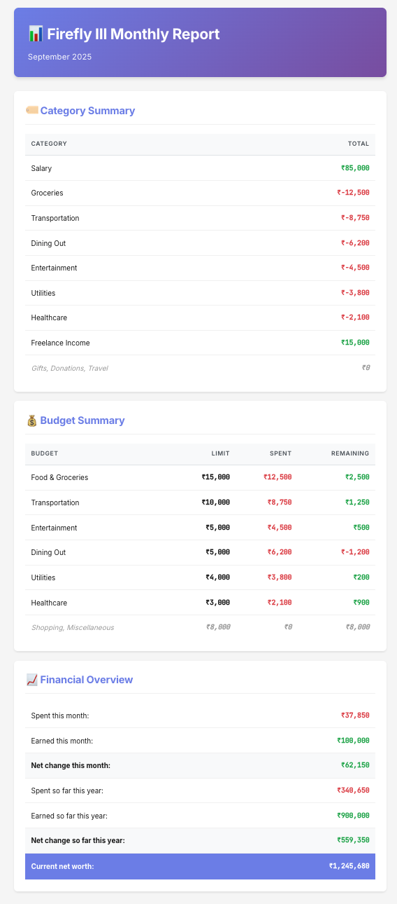

# Firefly III Monthly Email Report Generator

Beautiful HTML email reports for your Firefly III personal finance manager.



## Features

✨ **Beautiful Design**

- Modern, responsive HTML email design
- Professional gradient header with purple theme
- Color-coded financial data (green for positive, red for negative)
- Mobile-friendly layout with optimized fonts

📊 **Comprehensive Reports**

- **Category Summary**: All your transaction categories sorted by spending
- **Budget Tracking**: Budget limits, spending, and remaining amounts
- **Financial Overview**: Monthly and yearly summaries, net worth
- **Money Flow Sankey**: Visual flow from income sources → total income hub → budgets → expense categories (plus savings)

💰 **Smart Features**

- Zero-value items grouped together at the end
- Sorted by spending amount (highest first)
- Currency symbol support (₹, $, €, £, etc.)
- No line-breaking between currency symbols and amounts
- Interactive Sankey diagram tooltips with proportional percentages of total income

🔔 **Optional Healthcheck Integration**

- Ping healthchecks.io or similar services after successful email delivery
- Monitor your monthly report automation

## Requirements

- Python 3.7 or higher
- A running Firefly III instance with API access
- SMTP server credentials (Gmail, Outlook, etc.)

## Installation

1. **Clone or download this repository**

2. **Install required Python packages**:

   ```bash
   pip install pyyaml requests beautifulsoup4
   ```

3. **Copy the configuration template**:

   ```bash
   cp config-template.yaml config.yaml
   ```

4. **Edit `config.yaml` with your settings**:
   - Firefly III URL and API token
   - SMTP server details
   - Email addresses
   - Currency settings

## Configuration

### Getting Your Firefly III API Token

1. Log in to your Firefly III instance
2. Go to **Options** → **Profile** → **OAuth**
3. Click **Create New Token** under "Personal Access Tokens"
4. Copy the token and paste it in `config.yaml`

### Gmail Setup

If using Gmail, you need to:

1. Enable 2-Factor Authentication on your Google account
2. Generate an App Password:
   - Go to https://myaccount.google.com/apppasswords
   - Select "Mail" and your device
   - Copy the 16-character password
3. Use this app password in `config.yaml`

**Recommended Gmail settings**:

```yaml
smtp:
  server: smtp.gmail.com
  port: 587
  starttls: true
  authentication: true
  user: your-email@gmail.com
  password: "your-app-password"
```

### Other SMTP Providers

**Outlook/Office365**:

```yaml
smtp:
  server: smtp.office365.com
  port: 587
  starttls: true
```

**Yahoo**:

```yaml
smtp:
  server: smtp.mail.yahoo.com
  port: 587
  starttls: true
```

## Usage

### Preview Mode (Testing without Sending Email)

Before sending emails, you can generate a preview HTML file to see exactly how your report will look:

```bash
python3 monthly-report.py --preview
```

This will:

- Fetch all data from your Firefly III instance
- Generate `preview.html` in the same directory
- **NOT** send any email
- Display the file path so you can open it in your browser

Perfect for:

- Testing your configuration
- Checking the report appearance
- Verifying data accuracy
- Making styling changes

### Manual Execution

Run the script manually to send the email:

```bash
python3 monthly-report.py
```

This will generate a report for the previous month and send it via email.

### Automated Monthly Reports

#### Linux/macOS (cron)

Add to your crontab:

```bash
crontab -e
```

Add this line to run on the 1st of every month at 9 AM:

```
0 9 1 * * /usr/bin/python3 /path/to/monthly-report-template.py
```

#### Windows (Task Scheduler)

1. Open Task Scheduler
2. Create Basic Task
3. Set trigger to Monthly
4. Set action to run: `python3 C:\path\to\monthly-report-template.py`

## Sample Configuration

```yaml
---
firefly-url: "https://finance.example.com"
accesstoken: "eyJ0eXAiOiJKV1QiLCJhbGc..."
currency: "INR"
currency_symbol: "₹"

smtp:
  server: smtp.gmail.com
  port: 587
  starttls: true
  authentication: true
  user: myemail@gmail.com
  password: "abcd efgh ijkl mnop"

email:
  from: myemail@gmail.com
  to:
    - recipient@example.com

email_subject: "Monthly Financial Report"
healthcheck_url: "https://hc-ping.com/your-uuid-here"
```

## Email Report Contents

The email includes three main sections:

### 1. Category Summary

Shows all your transaction categories with total spent/earned, sorted by amount:

- Groceries: ₹10,000
- Transport: ₹5,000
- Salary: ₹50,000
- _Zero categories grouped at bottom_

### 2. Budget Summary

Displays budget performance:

- Budget name
- Limit amount
- Spent amount
- Remaining amount (red if over budget)

### 3. Financial Overview

- Spent this month
- Earned this month
- **Net change this month**
- Spent so far this year
- Earned so far this year
- **Net change so far this year**
- **Current net worth** (highlighted)

## Customization

### Change Colors

Edit the CSS in `monthly-report-template.py`:

- Header gradient: `.header { background: linear-gradient(...) }`
- Positive values: `.positive { color: #28a745; }`
- Negative values: `.negative { color: #dc3545; }`

### Change Fonts

The report uses:

- **Inter** for body text (clean, modern)
- **JetBrains Mono** for numbers (monospaced)

You can change these in the CSS `@import` and `font-family` properties.

### Currency Symbol

Set your currency symbol in `config.yaml`:

```yaml
currency_symbol: "₹" # or $, €, £, ¥, etc.
```

## Troubleshooting

### "ERROR: could not connect to SMTP server"

- Check your SMTP server address and port
- Verify firewall isn't blocking the connection
- For Gmail, ensure you're using an App Password

### "ERROR: could not authenticate with SMTP server"

- Verify your username and password
- For Gmail, use App Password, not regular password
- Check if 2FA is required

### "ERROR: Cannot connect to Firefly III API"

- Verify your Firefly III URL is correct
- Check the API token is valid
- Ensure Firefly III is accessible from where you run the script

### Email not arriving

- Check spam/junk folder
- Verify recipient email addresses
- Look for bounce-back emails
- Enable debug mode: `s.set_debuglevel(1)`

## Security Notes

⚠️ **Important Security Practices**:

1. **Never commit `config.yaml`** to version control
2. Use app passwords, not main account passwords
3. Restrict file permissions: `chmod 600 config.yaml`
4. Keep your API token secret
5. Use HTTPS for Firefly III URL

## License

MIT License - Feel free to use and modify!

## Credits

Based on [David Schlachter’s firefly-iii-email-summary](https://github.com/davidschlachter/firefly-iii-email-summary), this community-enhanced version features a modern design, improved message formatting, and added budget summaries.

## Support

- [Firefly III Documentation](https://docs.firefly-iii.org/)
- [Firefly III GitHub](https://github.com/firefly-iii/firefly-iii)

## Related Project: Firedash

**Firedash** is an interactive dashboard designed to complement Firefly III. It focuses on monthly reporting, helping you visualize spending habits, track category usage, and review financial health through a clean, responsive interface.

Explore it here: https://firedash.yemzikk.in/

## Contributing

Contributions welcome! Feel free to:

- Report bugs
- Suggest features
- Submit pull requests
- Share your customizations

---

**Enjoy your beautiful financial reports! 📊💰**
